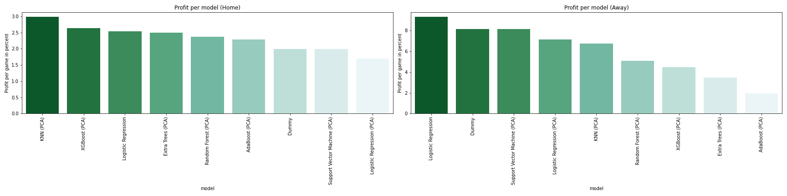

# Oddstradamus
## Good odds and where to find them

The author: [Daniel Müller](https://github.com/mue94)

## Overview

This project is based on almost 60,000 football match data from 22 different leagues of the last 8 seasons. The data source used contains data on the participating teams, the match-specific number of goals, shots, shots on target, corners, yellow cards and red cards. In addition, the corresponding betting odds of a large number of bookmakers regarding the three-way result are available.

The project in this repository is part of the final assessment of the Data Science Bootcamp at [neuefische - School and Pool for Digital Talent](https://www.neuefische.de). This project is about the development of a profitable long-term strategy in the field of sports betting with the help of data science methods and machine learning algorithms. The three fundamental aspects are the selection of suitable games, the prediction of these games and the selection of the optimal stake per bet.

## ML models used

- Logistic Regression
- Support Vector Machine
- Random Forest
- Extra Trees
- KNN
- AdaBoost
- XGBoost

## Content

- [1 Introduction](https://github.com/mue94/oddstradamus/blob/main/01_Introduction.ipynb): Introduction / Merging the data / Description of the columns
- [2 Data Processing](https://github.com/mue94/oddstradamus/blob/main/02_Data_Processing.ipynb): Processing of historical data into usable data for prediction / Data cleaning / Feature engineering / Compilation of data frames for modelling
- [3 EDA](https://github.com/mue94/oddstradamus/blob/main/03_EDA.ipynb): Data exploration / Checking correlations / Gaining deeper insights into the data
- [4 Model Preprocessing](https://github.com/mue94/oddstradamus/blob/main/04_Model_Preprocessing.ipynb): Description of the features used / Train-Test-Split
- [5 Model Home](https://github.com/mue94/oddstradamus/blob/main/05_Model_Home.ipynb): _Home Data Sets_ Defining the metric / Dummy Classifier / Scaling the data / Reducing the dimensions / Base models
- [6 Model Away](https://github.com/mue94/oddstradamus/blob/main/06_Model_Away.ipynb): _Away Data Sets_ Defining the metric / Dummy Classifier / Scaling the data / Reducing the dimensions / Base models
- [7 Results](https://github.com/mue94/oddstradamus/blob/main/07_Results.ipynb): Results / Recommendations / Limitations / Further Work

## Conclusion

The best performance was ultimately achieved by the logistic regression on the _favourites data frame_ in predicting the two-way outcome between _away win (2)_ or double chance _home win or draw (1X)_. The model achieved a profit of 9.29% per period. However, it should also be noted that even the dummy classifier, after thoroughly pre-selecting the suitable matches, predicts an _away win (2)_ in every case and was able to achieve a profit of 8.14% per period. Provided that lower profits are accepted, this strategy is ultimately a much more manageable variant than using the original logistic regression with over 100 features.

## Further Work

The optimisation of the strategy is far from complete. The problem offers a multitude of further starting points that require closer examination. Such aspects are listed below as examples:

- Optimisation of the individual algorithms not yet completed. Improvement potential of the hyperparameters not exhausted.
- Inclusion of further data or features (e.g. ball possession, odd fluctuations or teams in direct duels).
- Investigation of other target variables. Practically every playable bet conceivable.
- Examine game selection with regard to the underdog tip. Are profitable wins also possible on a regular basis using ML in this area?
- Develop different approaches to the optimal choice of betting stake.
- ...